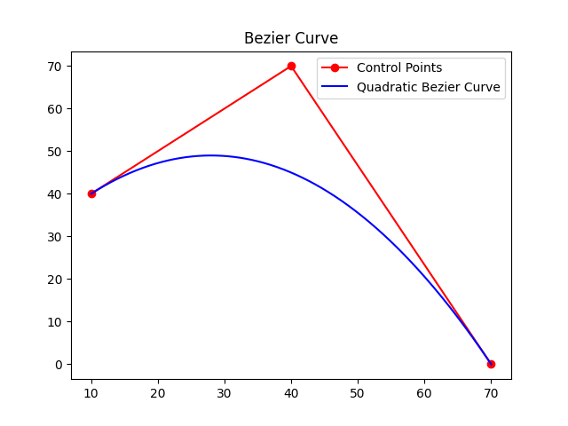
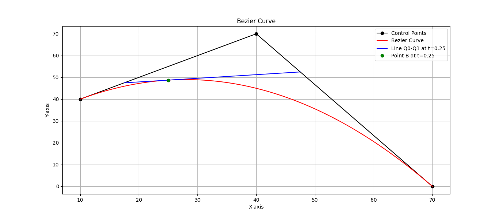

# Aproksimasi Kurva Bezier

Demo langsung: Kurva Bezier dengan Metode Brute Force | Kurva Bezier dengan Metode Divide and Conquer

## Daftar Isi
* [Informasi Umum](#informasi-umum)
* [Tujuan](#tujuan)
* [Mengapa Melakukannya](#mengapa-melakukannya)
* [Teknologi yang Digunakan](#teknologi-yang-digunakan)
* [Fitur](#fitur)
* [Output](#output)
* [Setup](#setup)
* [Dependensi](#dependensi)
* [Penggunaan](#penggunaan)
* [Status Proyek](#status-proyek)
* [Ruangan untuk Perbaikan](#ruangan-untuk-perbaikan)
* [Ucapan Terima Kasih](#ucapan-terima-kasih)
* [Kontak](#kontak)


## Informasi Umum
Proyek ini bertujuan untuk mengaproksimasi kurva Bezier kuadratik menggunakan algoritma brute-force dan divide-and-conquer. Kurva Bezier banyak digunakan dalam grafika komputer dan aplikasi desain untuk membuat kurva yang halus berdasarkan serangkaian titik kontrol.

## Tujuan
Tujuan dari proyek ini adalah untuk membandingkan kinerja dan akurasi dari algoritma brute-force dan divide-and-conquer dalam mengaproksimasi kurva Bezier. Dengan mengimplementasikan kedua algoritma ini, kita dapat mengevaluasi waktu eksekusi dan kualitas kurva yang dihasilkan.

## Mengapa Melakukannya ?
Memahami berbagai algoritma untuk aproksimasi kurva sangat penting dalam grafika komputer dan desain. Dengan mengimplementasikan dan membandingkan algoritma-algoritma ini, kita dapat memperoleh wawasan tentang kelebihan, kelemahan, dan aplikasi praktisnya.

## Teknologi yang Digunakan
- Python - versi 3.12.2
- Matplotlib - versi  3.8.3
- NumPy - versi 1.26.4

## Fitur
Daftar fitur yang sudah siap :
- Algoritma brute-force untuk mengaproksimasi kurva Bezier kuadratik.
- Algoritma divide-and-conquer untuk mengaproksimasi kurva Bezier kuadratik.
  
## Output



## Setup

Untuk menjalankan proyek ini, pastikan Anda sudah menginstal Python. Clone repositori dan navigasikan ke direktori proyek.

### Dependensi

Pastikan untuk menginstal dependensi berikut sebelum menjalankan proyek:

- [NumPy](https://numpy.org/): Library untuk komputasi numerik dalam Python.
- [Matplotlib](https://matplotlib.org/): Library untuk membuat visualisasi data dalam Python.
- [Time](https://docs.python.org/3/library/time.html): Modul standar Python untuk manajemen waktu.

Anda dapat menginstal dependensi menggunakan pip:

```bash
pip install numpy
```
```bash
pip install numpymatplotlib
```

## Penggunaan

- Jalankan skrip [Algoritma Brute Force](./src/bezierCurveBruteForce.py) untuk algoritma brute-force dan [Algoritma Devide and Conquer](./src/bezierCurveDivideandConquer.py)` untuk algoritma Divide and Conquer.
- Masukkan koordinat untuk tiga titik kontrol saat diminta.
- Masukkan jumlah iterasi untuk aproksimasi kurva.
- Lihat plot kurva Bezier yang dihasilkan dan waktu eksekusi.

## Status Proyek
Proyek ini sudah selesai.

## Ruangan untuk Perbaikan
Area yang dapat diperbaiki :
- Implementasikan algoritma lebih lanjut untuk aproksimasi kurva.
- Tingkatkan antarmuka pengguna untuk interaksi dan visualisasi yang lebih baik.

Yang akan dilakukan :
- Tambahkan dukungan untuk kurva Bezier dengan orde yang lebih tinggi.
- Implementasikan teknik optimasi untuk eksekusi yang lebih cepat.

## Ucapan Terima Kasih
Proyek ini terinspirasi oleh [sumber atau inspirasi yang dimasukkan](https://informatika.stei.itb.ac.id/~rinaldi.munir/Stmik/2023-2024/Tucil2-2024.pdf)].

## Kontak
Dibuat oleh [Muhammad Fiqri] - Silakan Hubungi Saya! Email: [email_anda@contoh.com]
